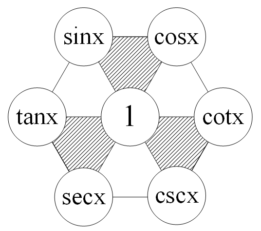

# 常用公式

## 希腊字母表

读音|大写|小写|读音|大写|小写
:--:|:--:|:--:|:--:|:--:|:--:
Alpha|$\Alpha$|$\alpha$|Nu|$\Nu$|$\nu$
Beta|$\Beta$|$\beta$|Xi|$\Xi$|$\xi$
Gamma|$\Gamma$|$\gamma$|Omicron|$O$|$o$
Delta|$\Delta$|$\delta$|Pi|$\Pi$|$\pi$
Epsilon|$\Epsilon$|$\epsilon$|Rho|$\Rho$|$\rho$
Eta|$\Eta$|$\eta$|Sigma|$\Sigma$|$\sigma$
Zeta|$\Zeta$|$\zeta$|Tau|$\Tau$|$\tau$
Theta|$\Theta$|$\theta$|Upsilon|$\Upsilon$|$\upsilon$
Iota|$\Iota$|$\iota$|Phi|$\Phi$|$\phi$
Kappa|$\Kappa$|$\kappa$|Chi|$\Chi$|$\chi$
Lambda|$\Lambda$|$\lambda$|Psi|$\Psi$|$\psi$
Mu|$\Mu$|$\mu$|Omega|$\Omega$|$\omega$
|$\hbar$|$\aleph$|$\partial$|$\Re$

$$\mathcal{ABCDEFGHIJKLMNOPQRSTUVWXYZ}$$

## 三角函数

### 基本关系

$$
\left \{
\begin{aligned}
\sin^2\theta+\cos^2\theta=1 \\
\tan^2\theta+1^2=\sec^2\theta \\
\cot^2\theta+1^2=\csc^2\theta
\end{aligned}
\right.
$$

### 和差化积
$$
\left \{
\begin{aligned}
\sin\alpha+\sin\beta&=2\sin\frac{\alpha+\beta}{2}\cos\frac{\alpha-\beta}{2} \\
\sin\alpha-\sin\beta&=2\cos\frac{\alpha+\beta}{2}\sin\frac{\alpha-\beta}{2} \\
\cos\alpha+\cos\beta&=2\cos\frac{\alpha+\beta}{2}\cos\frac{\alpha-\beta}{2} \\
\cos\alpha-\cos\beta&=-2\sin\frac{\alpha+\beta}{2}\sin\frac{\alpha-\beta}{2} \\
\end{aligned}
\right.
$$

## 导数表

## 积分表

